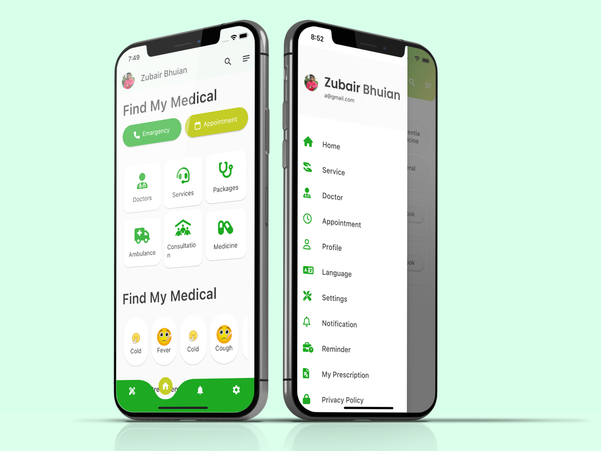
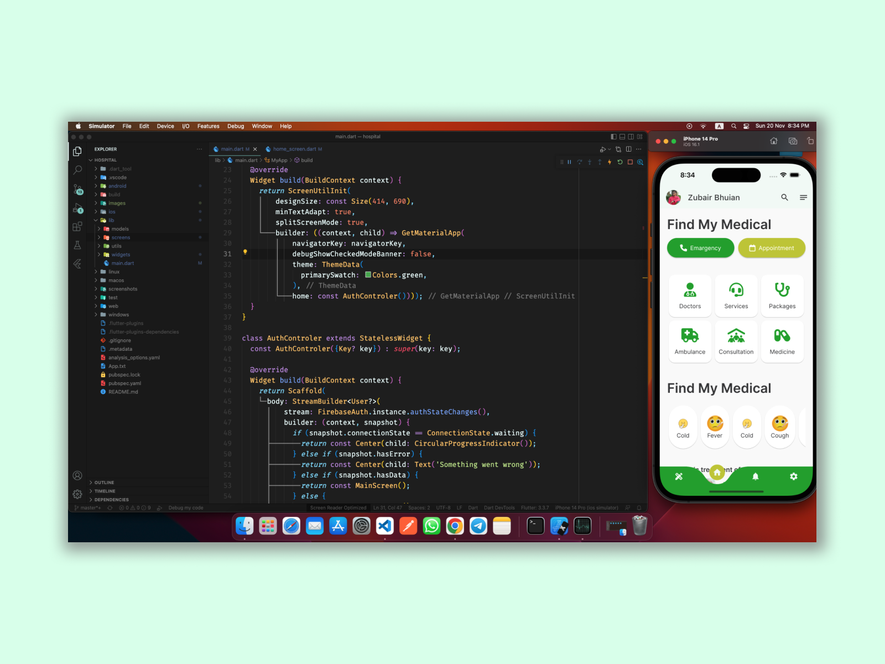

# hospital

&nbsp;&nbsp;
&nbsp;&nbsp;
<a href="https://choosealicense.com/licenses/mit/" target="_blank"></a>&nbsp;&nbsp;
&nbsp;&nbsp;


# Hospital
Hellow, This is a Hospital Management applications </br>
## [Download Demo App](https://bhuianfoodapi.herokuapp.com/download/learnquran)
<br/>


<!--  -->
# App screen
<p align="center">
    
</p>

<p align="center">
    
</p>

<p align="center">
    
</p>

Designer [Omar Faruk](https://web.facebook.com/omarfarukuiux) </br>
Developer [Zubair Bhuian](https://web.facebook.com/zubair.bhuian)


## How to Run This

1. **Clone the repository:**

    ```
    git clone https://github.com/zubairbhuian/hospital.git
    ```

2. **Navigate to the project directory:**

    ```
    cd hospital
    ```

3. **Install dependencies:**

    ```
    flutter pub get
    ```

4. **Run the app:**

    ```
    flutter run 
    ```

   This command will build and run the Flutter app on a connected device or emulator.
