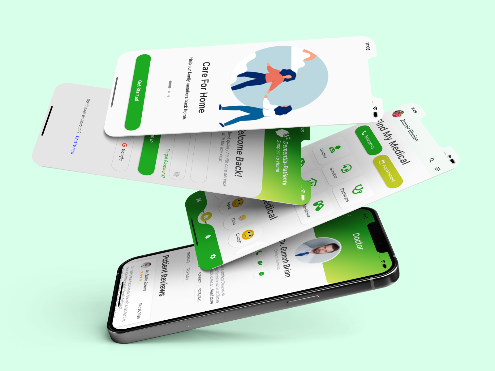
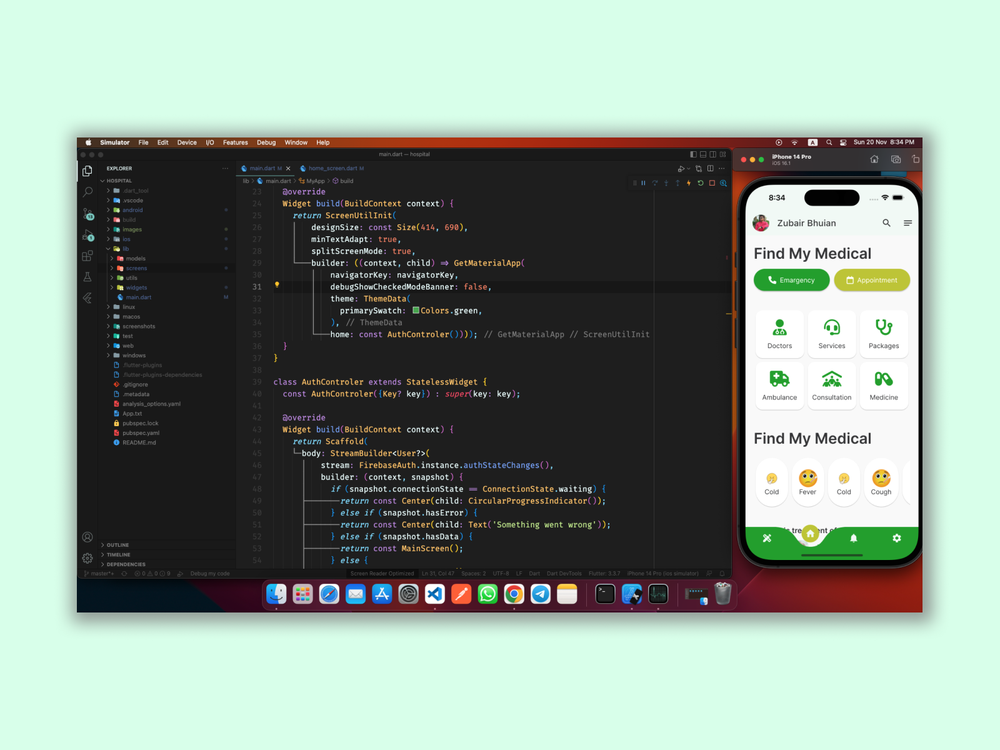

&nbsp;&nbsp;
&nbsp;&nbsp;
<a href="https://choosealicense.com/licenses/mit/" target="_blank"></a>&nbsp;&nbsp;
&nbsp;&nbsp;


# Hospital
Hellow, This is a Hospital Management applications </br>
## [Download Demo App](https://bhuianfoodapi.herokuapp.com/download/learnquran)
<br/>


<!--  -->
# App screen
<p align="center">
    
</p>

<p align="center">
    
</p>

<p align="center">
    
</p>

Designer [Omar Faruk](https://web.facebook.com/omarfarukuiux) </br>
Developer [Zubair Bhuian](https://web.facebook.com/zubair.bhuian)

## Directory
```dart
lib
 |-- models
 |-- screens
 |   |-- splash_screen.dart 
 |   |-- home_screen.dart 
 |   |-- login_screen.dart 
 |   |-- singin_screen.dart 
 |   |-- home_screen.dart 
 |-- utils
 |   |-- apps_color.dart 
 |   |-- apps_color.dart 
 |-- widgets
 |-- main.dart 

```